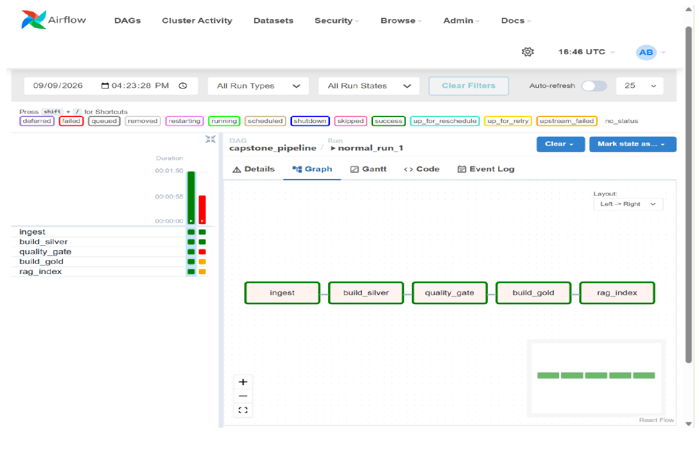
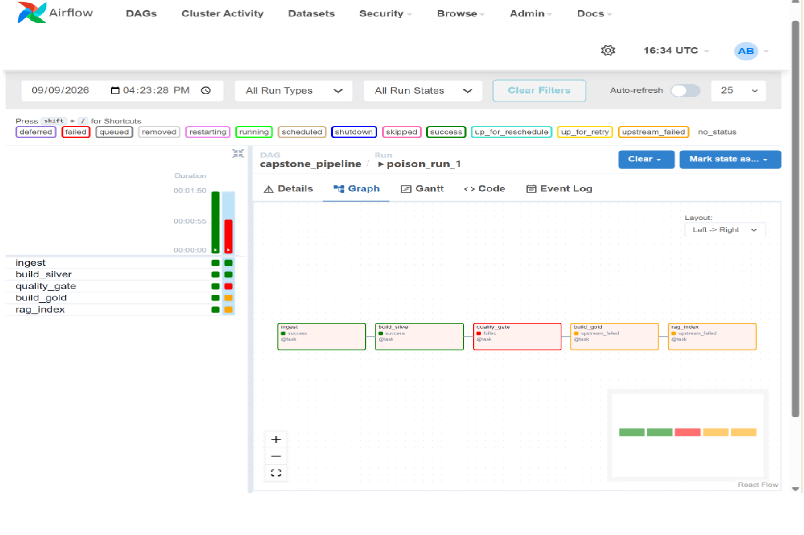

# Results & Evidence

Captured output from real runs, one section per rubric deliverable. Raw run
logs are in [`evidence/`](evidence/) (pipeline run, failure path, OpenLineage
events, pytest, Airflow task states + task logs, dead-letter sample, Gold
sample). The executed notebooks under [`../notebooks/`](../notebooks/) hold the
same runs with their output cells saved; Airflow Graph-view screenshots are
under [`images/`](images/).

Environment: Windows 11, Python 3.12, `deltalake` (delta-rs, no Spark/JVM),
`fastembed` / ONNX Runtime for embeddings (PyTorch is blocked by Smart App
Control on this machine), Kafka + Qdrant + Airflow via Docker.

Test suite: **98 tests pass** (`python -m pytest -q`), plus RAG/Gold
integration tests that skip when Qdrant is not reachable.

---

## 1. Ingestion (Kafka + Pydantic contract + dead-letter) - 20 pts

`python -m src.ingestion.producer` / `python -m src.ingestion.consumer`, run on
a 1200-record batch (seed 11, 12% deliberately malformed):

```
published 1200 records to 'vitals.raw'
consumed=1200  ->  bronze=1074   deadletter=126
```

Every malformed record is rejected at the contract and routed to
`vitals.deadletter` with its reason and source offset:

```
DLQ p0@4   spo2: Input should be greater than or equal to 50
DLQ p2@52  recorded_at: Value error, ... is in the future
DLQ p1@24  diagnosis: Extra inputs are not permitted
DLQ p2@81  patient_id: String should match pattern '^P\d{6}$'
```

Bronze afterwards: 1074 rows, all six vitals within their physiological ranges,
typed Delta schema. No malformed record reaches Bronze.

## 2. Delta Lakehouse (Bronze / Silver / Gold) - 25 pts

```
silver merge   ->  source_rows=1074  inserted=1074  updated=0    (Silver total 1074)
gold           ->  139 rows   = 7.7x reduction from Silver
                   worst_risk_band: {'low': 135, 'high': 4}
```

**Real MERGE upsert on the business key.** Re-sending 5 `reading_id`s with
changed vitals:

```
merge metrics: num_target_rows_updated=5  num_target_rows_inserted=0
Silver rows    before=1074  after=1074       (upsert in place, not appended)
```

**Gold is a genuine aggregate.** Deteriorating patient `P100007` across four
one-hour windows:

| window | readings | mean NEWS2 | max NEWS2 | band | min SpO2 |
|--------|----------|-----------|-----------|------|----------|
| 05:00  | 4  | 5.5  | 11 | high | 91 |
| 06:00  | 5  | 9.4  | 10 | high | 92 |
| 07:00  | 6  | 12.0 | 16 | high | 90 |
| 08:00  | 3  | 15.7 | 17 | high | 87 |

**Schema enforcement.** delta-rs refuses a write whose `heart_rate` column is
`string` instead of `int32`, and refuses an extra column
(`tests/test_bronze_schema.py`, plus notebook 02).

## 3. RAG (hybrid + RRF + cross-encoder, grounded + cited) - 25 pts

```
build -> 22 chunks from 7 guideline documents, indexed in Qdrant
```

`ask "When should sepsis screening be started?"`:

```
A NEWS2 aggregate of 5 or more, or a single parameter scoring 3, in a patient
with likely infection should trigger a sepsis screen. [1] Screen any patient
with a suspected or confirmed infection who also shows signs of acute illness. [1]

Citations:
  [1] Recognising sepsis and the Sepsis Six - When to screen for sepsis (rerank 0.67)

Fused hybrid retrieval:
  sepsis-screening::0   rrf=0.030   dense_rank=1   bm25_rank=13
```

The cross-encoder lifts `sepsis-screening` from RRF rank ~5 to the top of the
answer. An off-topic question ("gift shop hours") is **refused** - every chunk
scores below the rerank floor. `explain_gold_window()` turns a Gold NEWS2 row
into the retrieval query, linking deliverable 2 to deliverable 3.

## 4. Orchestration (Airflow DAG) - 15 pts

`dags/capstone_pipeline.py`:
`ingest >> build_silver >> quality_gate >> build_gold >> rag_index`.

**Normal run** (`airflow dags trigger capstone_pipeline`):

```
ingest        success   (~31s)
build_silver  success   (~14s)
quality_gate  success   (~26s)
build_gold    success   (~14s)
rag_index     success   (~19s)
```



**Failure run** (`--conf '{"poison": true}'` injects an out-of-range Bronze row):

```
ingest        success
build_silver  success
quality_gate  failed            <- gate raises QualityGateError
build_gold    upstream_failed   <- never ran
rag_index     upstream_failed   <- never ran
```



A failed quality gate halts the pipeline before every downstream stage.

## 5. Quality gate + lineage - 15 pts

**Great Expectations** - 14-expectation suite on Silver
(`src/quality/expectations.py`, suite at `gx/expectations/silver_quality.json`):

```
live Silver            ->  quality gate PASSED, 14/14 expectations met
corrupted Silver batch ->  QualityGateError, 3 expectations failed
   expect_column_values_to_be_unique(reading_id)      : 2 unexpected
   expect_column_values_to_be_between(heart_rate)     : 1 unexpected
   expect_column_values_to_be_between(spo2)           : 1 unexpected
```

**OpenLineage** - the two Airflow runs above emitted 16 events to
`lineage/events.jsonl`:

```
normal run:  START/COMPLETE x5  (ingest, build_silver, quality_gate, build_gold, rag_index)
poison run:  START/COMPLETE  ingest
             START/COMPLETE  build_silver
             START/FAIL      quality_gate   (ErrorMessageRunFacet: QualityGateError ...)
             (no build_gold / rag_index events - the run halted)
```

All events in one DAG run share a parent run id derived from the Airflow
`run_id`.
